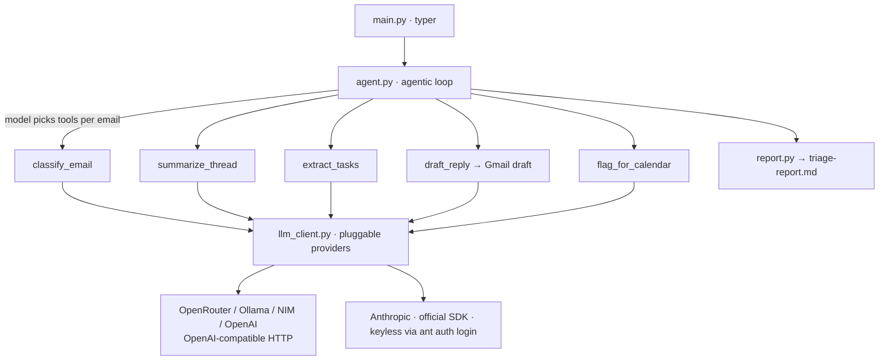

# inbox-to-action

[](https://pypi.org/project/inbox-to-action/)
[](https://www.python.org/)
[](LICENSE)
[](https://github.com/tarunlnmiit/inbox-to-action)
[](https://glama.ai/mcp/servers/tarunlnmiit/inbox-to-action)
[](https://smithery.ai/server/@tarunlnmiit/inbox-to-action)

Distributed on [PyPI](https://pypi.org/project/inbox-to-action/), the
[Glama](https://glama.ai/mcp/servers/tarunlnmiit/inbox-to-action) &
[Smithery](https://smithery.ai/server/@tarunlnmiit/inbox-to-action) MCP registries,
and the [Official MCP Registry](https://registry.modelcontextprotocol.io) (`server.json`).

> One command. Your inbox triaged, summarized, drafted, and turned into tasks — in a single agentic pass.

## Install

```bash
pip install inbox-to-action          # or: pipx install inbox-to-action
uvx inbox-to-action run --mock       # zero-install trial (uv)
pip install 'inbox-to-action[mcp]'   # + MCP server for Claude Code
docker run --rm ghcr.io/tarunlnmiit/inbox-to-action   # MCP server (stdio)
```

Try it with zero setup: `inbox-to-action run --mock` (bundled sample inbox).

📖 **Full documentation → [docs/](docs/README.md)** — [install](docs/01-install.md) · [providers](docs/02-providers.md) · [Gmail OAuth](docs/03-gmail-oauth.md) · [multi-account](docs/04-multi-account.md) · [integrations](docs/05-integrations.md) · [MCP & Skill](docs/06-mcp-and-skill.md) · [config](docs/07-config-and-triage.md) · [troubleshooting](docs/08-troubleshooting.md) · [testing checklist](docs/09-testing-checklist.md). Quick version: [SETUP.md](SETUP.md).

<!-- DEMO REEL -->
<p align="center">
  <em>📹 Demo GIF goes here — &lt;60s: run the command, watch the report appear.</em><br>
  <code>docs/demo.gif</code>
</p>

---

## Why this exists

Most people process their inbox with **four** separate tools: an email client to read,
a task manager to capture to-dos, a calendar to block time, and (increasingly) an
AI summarizer to make sense of long threads. Every message gets handled four times.

`inbox-to-action` collapses all four into **one agentic pass**. Run one command and get
a unified triage report, drafted replies saved to Gmail, and extracted tasks — without
ever leaving the terminal, and **without ever sending an email automatically**.

## 🔒 Drafts only — never sends

This tool **cannot send email**. It requests only the Gmail `readonly` + `compose`
scopes; there is no `send` scope and no send API call anywhere in the codebase
(enforced by a test). Replies are saved as **Gmail drafts** for you to review and send.

## What it does

1. **Fetches** unread email from Gmail (last 24h by default).
2. **Classifies** each into `action_needed` · `fyi` · `newsletter` · `noise`.
3. **Summarizes** long threads (>500 words) into two lines.
4. **Extracts** tasks with deadlines → local `tasks.md` (optional Todoist via `--todoist`).
5. **Drafts** replies for `action_needed` mail → saved as Gmail **drafts**.
6. **Flags** emails that need a calendar block.

Final output: a single **`triage-report.md`** with a section per category, drafted-reply
previews, a tasks summary, and a calendar list.

## Architecture — the agent loop

The model's own classification of each email drives which tools fire next — the pipeline
is **not** hardcoded. The same tool functions back the CLI agent and the MCP server.



```
fetch → for each email:  classify ─┬─ action_needed → extract_tasks + draft_reply + flag_calendar
                                   ├─ fyi / newsletter / noise → record only
                                   └─ (long thread) → summarize
                          → render triage-report.md
```

## Quick start (2 minutes)

```bash
git clone https://github.com/tarunlnmiit/inbox-to-action.git && cd inbox-to-action
python3 -m venv .venv && source .venv/bin/activate
pip install -e '.[mcp]'        # installs the `inbox-to-action` command
cp .env.example .env
```

This installs an `inbox-to-action` console command (and the `python -m
inbox_to_action.mcp_server` entry point used by Claude Code / Glama).

### Free-first: run end-to-end on zero spend

Pick whichever keyless/free path you like — all run the full pipeline at no cost:

**Option A — `claude` CLI (keyless, fastest; uses your Claude Code login):**
```bash
PROVIDER=claude inbox-to-action run --mock     # no API key; needs `claude` on PATH
```

**Option B — Ollama (truly keyless, fully local):**
```bash
ollama serve            # in another terminal
ollama pull llama3.1
PROVIDER=ollama inbox-to-action run --mock     # uses bundled sample inbox
```

**Option C — OpenRouter free model (free signup key):**
```bash
# put OPENROUTER_API_KEY in .env (free models, $0 spend)
inbox-to-action run --mock                      # default PROVIDER=openrouter
```

**Option D — inside Claude Code (keyless, Claude Code is the LLM):** see below.

`--mock` uses the bundled sample inbox so you can see a full report with **zero Gmail
setup**. Drop `--mock` once you've authorized Gmail. Free OpenRouter models are often
rate-limited; the client auto-rotates a fallback list and retries with backoff.

### Real inbox

```bash
# 1. Create OAuth credentials in Google Cloud Console (Desktop app),
#    download client_secret.json into the project, then:
inbox-to-action auth                 # one-time consent (read + compose only)
inbox-to-action run --since 24h --no-drafts   # safe first pass: report only, no writes
inbox-to-action run --since 24h      # triage the last day (creates Gmail drafts)
inbox-to-action run --since 3d --max 40 --todoist
```

- `--no-drafts` — classify, summarize, extract tasks, write the report, but create
  **no** Gmail drafts. Recommended for a first run.
- `--max N` — cap emails per account (default 25) to bound cost/volume.
- Automated **no-reply** senders (security alerts, notifications) never get a drafted
  reply — the report notes them instead.

### Telegram summary (`--telegram`)

Push a concise summary to your phone after each run — counts, action-needed subjects
(with draft-ready status), extracted tasks, and a link to your Gmail Drafts.

```bash
# 1. In Telegram, message @BotFather → /newbot → copy the bot token.
# 2. Message your new bot once (say "hi"), then open:
#    https://api.telegram.org/bot<token>/getUpdates  → copy "chat":{"id": ...}.
# 3. Put both in .env:
#    TELEGRAM_BOT_TOKEN=...   TELEGRAM_CHAT_ID=...
inbox-to-action run --since 24h --telegram
```

Off by default (opt-in flag). A send failure never breaks the run.
**Privacy:** this sends email subjects + extracted tasks to Telegram's servers (into
your own chat). It's notification only — it never sends email.

### Multiple accounts (Gmail, Google Workspace, Outlook)

Declare accounts in `config.json` — one merged report, each email tagged with its
account. Personal Gmail and Workspace both use the Gmail path (Workspace may need
your admin to allow the OAuth app). Outlook uses Microsoft Graph (read + draft only).

```json
{
  "accounts": [
    { "id": "personal", "kind": "gmail",   "label": "Personal Gmail" },
    { "id": "work",     "kind": "gmail",   "label": "Workspace" },
    { "id": "outlook",  "kind": "outlook", "label": "Outlook", "client_id": "AZURE_APP_ID" }
  ]
}
```

```bash
inbox-to-action auth --account personal   # authorize each account once
inbox-to-action auth --account work
inbox-to-action run --since 24h           # fetches + triages across all accounts
```

Multiple personal Gmail accounts can reuse one `client_secret.json` — each gets its
own cached token (`~/.config/inbox-to-action/tokens/<id>.json`). With no `accounts`
block, the tool uses a single default Gmail account (backwards compatible).

## Use inside Claude Code (keyless)

When run inside Claude Code, **Claude Code is the LLM** — no provider key needed.
Two integration paths ship in this repo:

### MCP server
Exposes IO-only tools (`fetch_emails`, `save_gmail_draft`, `append_tasks`, `write_report`).
Claude Code does the classify/summarize/extract/draft reasoning itself and calls these.

```bash
# after `pip install -e '.[mcp]'`
claude mcp add inbox-to-action -- python -m inbox_to_action.mcp_server
```

This is the same stdio server that the [Glama](https://glama.ai) listing builds from
the bundled `Dockerfile` (`CMD python -m inbox_to_action.mcp_server`).

### Skill
Copy `skills/inbox-to-action/` into your Claude Code skills directory, then type
`/inbox-to-action`. The skill instructs Claude Code to fetch, reason, draft, and write
the report — keyless.

## Anthropic (keyless via `ant auth login`)

The Anthropic provider uses the official SDK with a zero-arg client, so it picks up your
`ant auth login` OAuth profile — **no `ANTHROPIC_API_KEY` required**:

```bash
ant auth login
PROVIDER=anthropic inbox-to-action run --mock   # default model: claude-opus-4-8
```

## Configuration

All keys live in `.env` (`.env.example` is committed). Switch providers with `PROVIDER`:
`openrouter` (default) · `ollama` · `nim` · `openai` · `anthropic` · `claude` · `host`.

### Configure triage (make it *yours*)

The default buckets are generic — newsletters and job alerts are treated as no-action.
Override that with `config.json` (copy `config.example.json`). Two layers:

- **`rules`** — deterministic `field → category` overrides applied **before** the LLM
  (fast, free, exact). First match wins. `field` ∈ `sender | subject | body | any`.
- **`triage_instructions`** — freeform guidance injected into the classifier prompt for
  nuance the model interprets.

```json
{
  "triage_instructions": "I'm job hunting in ML/AI — treat relevant job alerts as action_needed.",
  "rules": [
    { "field": "sender",  "contains": "hirist.tech", "category": "action_needed" },
    { "field": "subject", "contains": "invoice",     "category": "noise" }
  ]
}
```

```bash
cp config.example.json config.json   # edit to taste (config.json is gitignored)
inbox-to-action run --since 24h                 # auto-loads ./config.json
inbox-to-action run --config /path/to/other.json
```

Quick override without a file: `TRIAGE_INSTRUCTIONS="treat job alerts as action_needed"`.

## Tests

```bash
pytest --cov=.        # 100+ tests, 90%+ coverage, incl. the never-send security test
```

## Docs

- **[docs/](docs/README.md)** — full guides with screenshots: install, every LLM provider, Gmail OAuth, multi-account, integrations, MCP & Skill, config, troubleshooting, testing checklist.
- [SETUP.md](SETUP.md) — 5-minute quickstart.
- [CONTRIBUTING.md](CONTRIBUTING.md) — dev setup + the never-send rule.
- [CLAUDE.md](CLAUDE.md) — project map for Claude Code.

## Built with

This project demonstrates the contract skills:

- **Agentic orchestration** — model-driven, per-email tool selection (no hardcoded pipeline).
- **Function calling** — typed tool schemas (`agent.TOOL_SCHEMAS`) shared by the CLI agent and MCP server.
- **Multi-API integration** — Gmail + LLM + Todoist in one flow.
- **Pluggable LLM providers** — one `llm_client` swaps OpenRouter / Ollama / NIM / OpenAI / Anthropic.
- **Claude Code integration** — first-class MCP server **and** Skill, both keyless.

## License

MIT — see [LICENSE](LICENSE).
