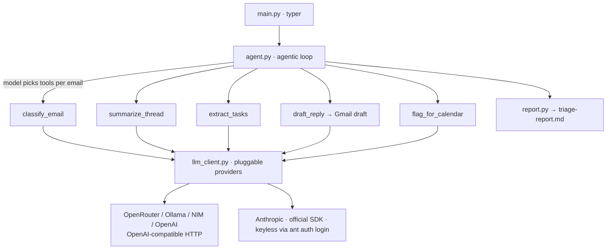

# inbox-to-action

> One command. Your inbox triaged, summarized, drafted, and turned into tasks — in a single agentic pass.

<!-- DEMO REEL -->
<p align="center">
  <em>📹 Demo GIF goes here — &lt;60s: run the command, watch the report appear.</em><br>
  <code>docs/demo.gif</code>
</p>

---

## Why this exists

Most people process their inbox with **four** separate tools: an email client to read,
a task manager to capture to-dos, a calendar to block time, and (increasingly) an
AI summarizer to make sense of long threads. Every message gets handled four times.

`inbox-to-action` collapses all four into **one agentic pass**. Run one command and get
a unified triage report, drafted replies saved to Gmail, and extracted tasks — without
ever leaving the terminal, and **without ever sending an email automatically**.

## 🔒 Drafts only — never sends

This tool **cannot send email**. It requests only the Gmail `readonly` + `compose`
scopes; there is no `send` scope and no send API call anywhere in the codebase
(enforced by a test). Replies are saved as **Gmail drafts** for you to review and send.

## What it does

1. **Fetches** unread email from Gmail (last 24h by default).
2. **Classifies** each into `action_needed` · `fyi` · `newsletter` · `noise`.
3. **Summarizes** long threads (>500 words) into two lines.
4. **Extracts** tasks with deadlines → local `tasks.md` (optional Todoist via `--todoist`).
5. **Drafts** replies for `action_needed` mail → saved as Gmail **drafts**.
6. **Flags** emails that need a calendar block.

Final output: a single **`triage-report.md`** with a section per category, drafted-reply
previews, a tasks summary, and a calendar list.

## Architecture — the agent loop

The model's own classification of each email drives which tools fire next — the pipeline
is **not** hardcoded. The same tool functions back the CLI agent and the MCP server.



```
fetch → for each email:  classify ─┬─ action_needed → extract_tasks + draft_reply + flag_calendar
                                   ├─ fyi / newsletter / noise → record only
                                   └─ (long thread) → summarize
                          → render triage-report.md
```

## Quick start (2 minutes)

```bash
git clone <repo> && cd inbox-to-action
python3 -m venv .venv && source .venv/bin/activate
pip install -r requirements.txt
cp .env.example .env
```

### Free-first: run end-to-end on zero spend

Pick whichever keyless/free path you like — all run the full pipeline at no cost:

**Option A — Ollama (truly keyless, fully local):**
```bash
ollama serve            # in another terminal
ollama pull llama3.1
PROVIDER=ollama python main.py run --mock     # uses bundled sample inbox
```

**Option B — OpenRouter free model (free signup key):**
```bash
# put OPENROUTER_API_KEY in .env (free models, $0 spend)
python main.py run --mock                      # default PROVIDER=openrouter
```

**Option C — inside Claude Code (keyless, Claude Code is the LLM):** see below.

`--mock` uses `fixtures/sample_inbox.json` so you can see a full report with **zero Gmail
setup**. Drop `--mock` once you've authorized Gmail.

### Real inbox

```bash
# 1. Create OAuth credentials in Google Cloud Console (Desktop app),
#    download client_secret.json into the project, then:
python main.py auth                 # one-time consent (read + compose only)
python main.py run --since 24h      # triage the last day
python main.py run --since 3d --todoist
```

## Use inside Claude Code (keyless)

When run inside Claude Code, **Claude Code is the LLM** — no provider key needed.
Two integration paths ship in this repo:

### MCP server
Exposes IO-only tools (`fetch_emails`, `save_gmail_draft`, `append_tasks`, `write_report`).
Claude Code does the classify/summarize/extract/draft reasoning itself and calls these.

```bash
claude mcp add inbox-to-action -- python /abs/path/to/inbox-to-action/main.py mcp
```

### Skill
Copy `skills/inbox-to-action/` into your Claude Code skills directory, then type
`/inbox-to-action`. The skill instructs Claude Code to fetch, reason, draft, and write
the report — keyless.

## Anthropic (keyless via `ant auth login`)

The Anthropic provider uses the official SDK with a zero-arg client, so it picks up your
`ant auth login` OAuth profile — **no `ANTHROPIC_API_KEY` required**:

```bash
ant auth login
PROVIDER=anthropic python main.py run --mock   # default model: claude-opus-4-8
```

## Configuration

All keys live in `.env` (`.env.example` is committed). Switch providers with `PROVIDER`:
`openrouter` (default) · `ollama` · `nim` · `openai` · `anthropic` · `host`.

## Tests

```bash
pytest --cov=.        # 50+ tests, 90%+ coverage, incl. the never-send security test
```

## Built with

This project demonstrates the contract skills:

- **Agentic orchestration** — model-driven, per-email tool selection (no hardcoded pipeline).
- **Function calling** — typed tool schemas (`agent.TOOL_SCHEMAS`) shared by the CLI agent and MCP server.
- **Multi-API integration** — Gmail + LLM + Todoist in one flow.
- **Pluggable LLM providers** — one `llm_client` swaps OpenRouter / Ollama / NIM / OpenAI / Anthropic.
- **Claude Code integration** — first-class MCP server **and** Skill, both keyless.

## License

MIT — see [LICENSE](LICENSE).
