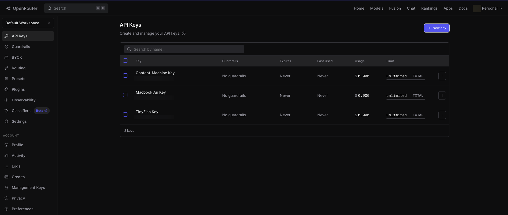
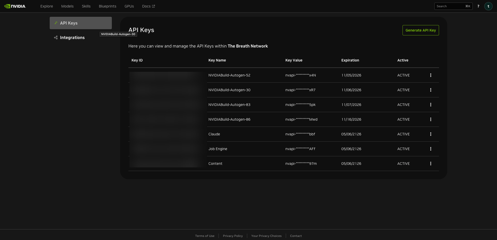
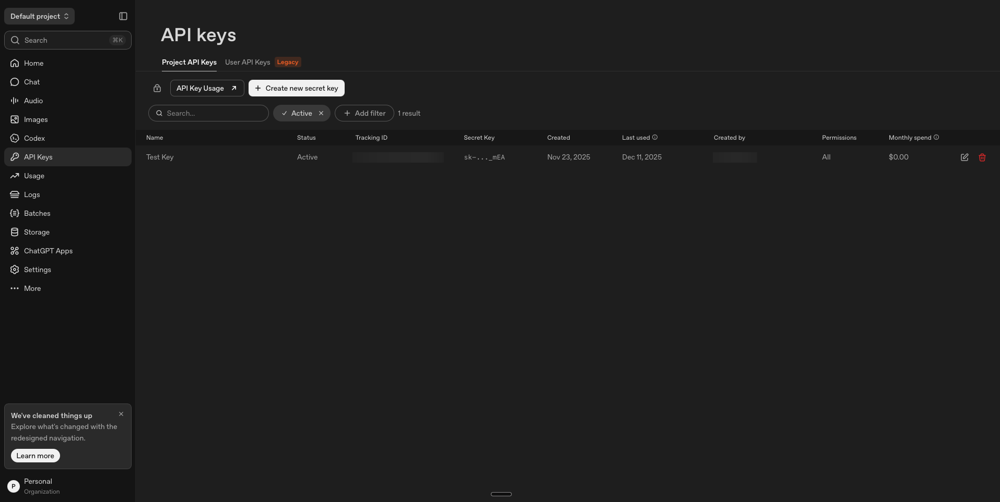

# 02 · LLM providers

Pick a backend with the `PROVIDER` env var (default `openrouter`). Override the model any time with `MODEL=...`. Put these in a `.env` file (copy [`.env.example`](../.env.example)) or export them.

| `PROVIDER` | Key env | Default model |
|------------|---------|---------------|
| `claude`   | none | your CLI default |
| `ollama`   | none | `llama3.1` |
| `openrouter` | `OPENROUTER_API_KEY` | `google/gemma-4-31b-it:free` |
| `nim`      | `NIM_API_KEY` / `NVIDIA_API_KEY` | `meta/llama-3.3-70b-instruct` |
| `openai`   | `OPENAI_API_KEY` | `gpt-4o-mini` |
| `anthropic`| `ANTHROPIC_API_KEY` (or keyless `ant`) | `claude-opus-4-8` |
| `host`     | none | — (Claude Code is the LLM) |

Test any provider instantly against the sample inbox:

```bash
PROVIDER=<name> inbox-to-action run --mock
```

---

## claude CLI (keyless) <a id="claude-cli-keyless"></a>

Uses your local **Claude Code** CLI as the model — no API key. Fastest way to test.

1. Install Claude Code: <https://claude.ai/code>
2. Sign in (`claude` once, follow the login).
3. Verify: `claude --print "hi"`.

```bash
# .env
PROVIDER=claude
# MODEL=  (optional; omit to use your CLI default)
```

```bash
PROVIDER=claude inbox-to-action run --mock
```

---

## Ollama (local, keyless) <a id="ollama-local-keyless"></a>

Fully local and private — nothing leaves your machine.

1. Install Ollama: <https://ollama.com>
2. `ollama serve` (starts the local server)
3. Pull a model: `ollama pull llama3.1`

```bash
# .env
PROVIDER=ollama
MODEL=llama3.1                     # or llama3.1:8b, qwen2.5:14b, …
# OLLAMA_BASE_URL=http://localhost:11434/v1   # override if remote
```

```bash
PROVIDER=ollama MODEL=llama3.1 inbox-to-action run --mock
```

---

## OpenRouter (free hosted models)

Free-tier models available; the client auto-rotates a fallback list and retries on rate limits (429).

1. Create an account: <https://openrouter.ai>
2. **Keys → Create key** → copy (starts with `sk-or-v1-…`).



```bash
# .env
PROVIDER=openrouter
OPENROUTER_API_KEY=sk-or-v1-…
# MODEL=google/gemma-4-31b-it:free   # default; falls back across free models automatically
```

```bash
PROVIDER=openrouter inbox-to-action run --mock
```

> Free models are often "rate-limited upstream" (429). The client backs off and rotates fallbacks automatically — just retry if a run stalls.

---

## NVIDIA NIM (free, strong models)

1. Sign in at <https://build.nvidia.com> and create an API key (starts with `nvapi-…`).



```bash
# .env
PROVIDER=nim
NIM_API_KEY=nvapi-…                 # NVIDIA_API_KEY is also accepted
# MODEL=meta/llama-3.3-70b-instruct  # default
```

```bash
PROVIDER=nim inbox-to-action run --mock
```

> Big NIM models can be slow on long threads. If you hit a timeout, raise it: `INBOX_TO_ACTION_HTTP_TIMEOUT=300`.

---

## OpenAI (cheap paid)

1. Create a key at <https://platform.openai.com/api-keys> (starts with `sk-…`).



```bash
# .env
PROVIDER=openai
OPENAI_API_KEY=sk-…
# MODEL=gpt-4o-mini                  # default
```

---

## Anthropic (best quality)

Two ways — with a key, or fully keyless via the `ant` CLI.

**With a key:**
1. Create a key at <https://console.anthropic.com> .
2. `pip install 'inbox-to-action[anthropic]'`

```bash
# .env
PROVIDER=anthropic
ANTHROPIC_API_KEY=sk-ant-…
# MODEL=claude-opus-4-8              # default (cheaper: claude-haiku-4-5)
```

**Keyless (`ant auth login`):** leave `ANTHROPIC_API_KEY` unset — the client uses your `ant` OAuth profile.

---

## host (Claude Code is the LLM)

`PROVIDER=host` runs **no** LLM here — reasoning comes from Claude Code via the MCP server or Skill. See [06 · MCP & Skill](06-mcp-and-skill.md). Not used for the standalone CLI.

Next: [connect Gmail →](03-gmail-oauth.md)
