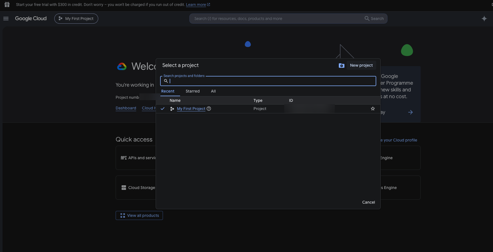
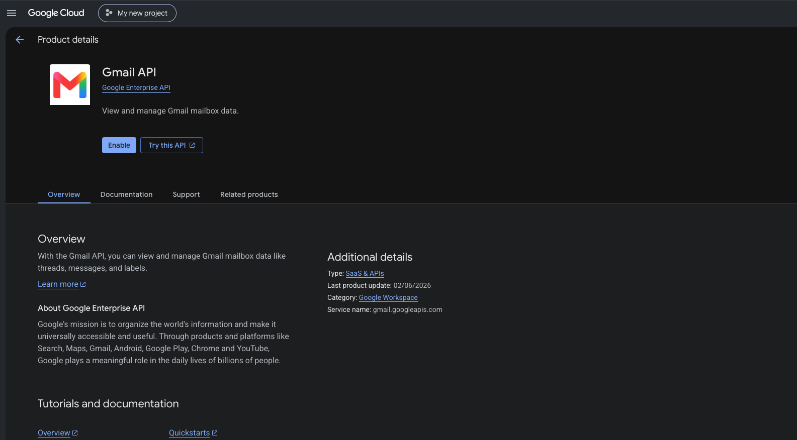
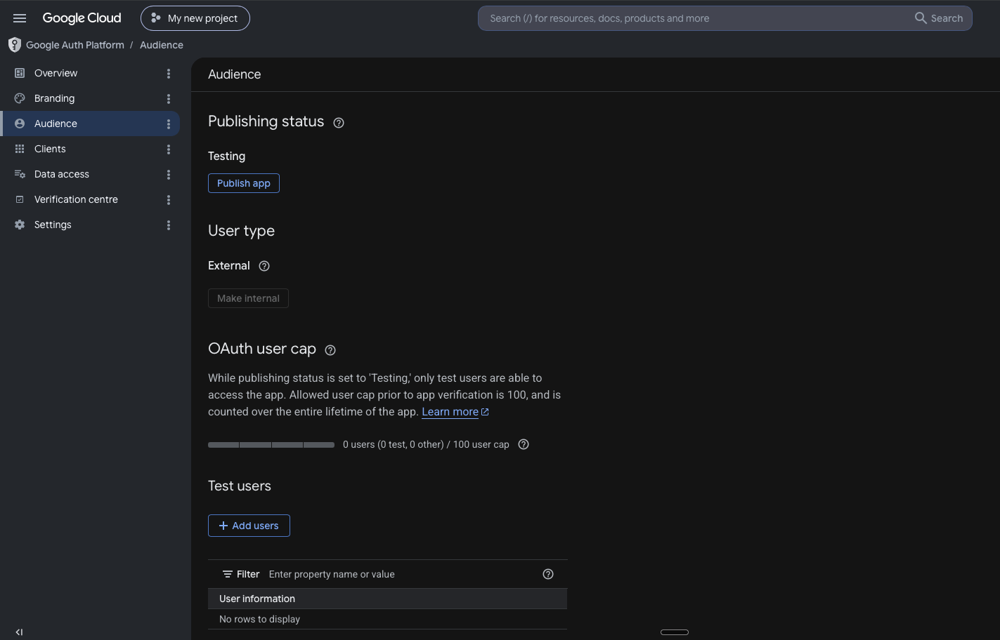
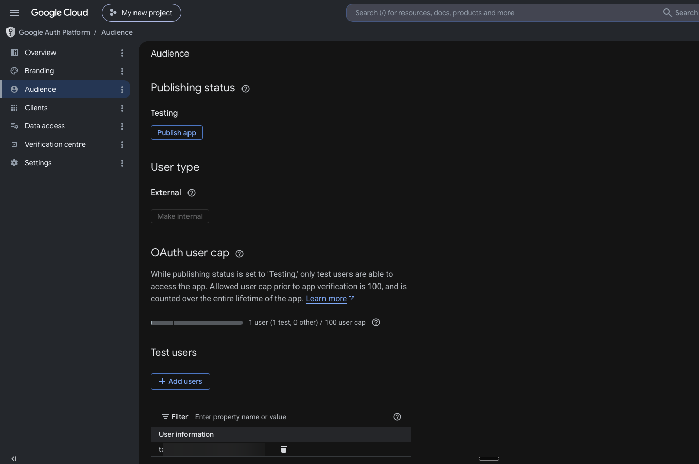
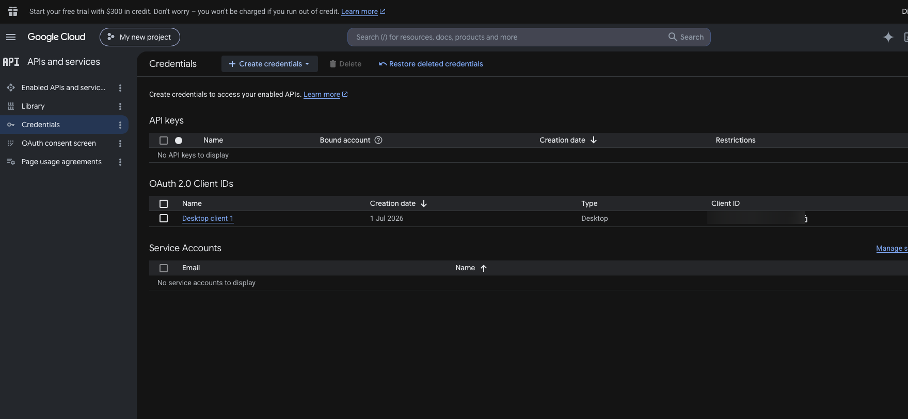

# 03 · Gmail OAuth setup

To read your inbox and save drafts, you create **your own** Google OAuth app and download a `client_secret.json`. This is a one-time ~5-minute setup.

> **Why your own app?** This is a self-hosted tool acting on *your* mailbox. Each user runs their own OAuth app and approves themselves — nothing scales through a shared app, and no Google verification is needed. (A single shared app using the `gmail.readonly` scope would require Google's paid CASA security assessment before anyone else could sign in.)

> 🔒 **Scopes requested: `gmail.readonly` + `gmail.compose` only.** No send scope, ever. The tool can read mail and create drafts — it cannot send.

---

## Step 1 — Create a Google Cloud project

1. Go to <https://console.cloud.google.com/> .
2. Top bar → project dropdown → **New Project** → name it (e.g. `inbox-to-action`) → **Create**.



## Step 2 — Enable the Gmail API

1. **APIs & Services → Library** → search **Gmail API** → **Enable**.



## Step 3 — Configure the OAuth consent screen

1. **APIs & Services → OAuth consent screen**.
2. User type: **External** → **Create**.
3. Fill the required fields (app name, your email as support + developer contact). Save through the steps. You can skip optional fields.
4. Leave the app in **Testing** mode (default). No verification needed.



## Step 4 — Add yourself as a Test user (critical)

In **Testing** mode, only listed test users can authorize the app.

1. OAuth consent screen → **Test users** → **+ Add users**.
2. Add the **exact Gmail address** you'll triage.
3. **Save**.



> ⚠️ **If you skip this** you'll get `Error 403: access_denied — App has not completed the Google verification process` at sign-in. The fix is always: add that account here.

## Step 5 — Create an OAuth client ID (Desktop app)

1. **APIs & Services → Credentials → + Create Credentials → OAuth client ID**.
2. Application type: **Desktop app** → name it → **Create**.
3. In the dialog → **Download JSON**. Save it as `client_secret.json`.



## Step 6 — Point the tool at your secret

Put `client_secret.json` in your working directory, **or** set the path:

```bash
# .env
GMAIL_CLIENT_SECRETS=/absolute/path/to/client_secret.json
```

(Default lookup: `client_secret.json` in the current directory.)

## Step 7 — Authorize (one-time browser consent)

```bash
inbox-to-action auth
```

- A browser opens. Sign in with the **test-user** account from Step 4.
- You'll see "Google hasn't verified this app" — that's expected for your own testing-mode app. **Advanced → Go to inbox-to-action (unsafe) → Continue**.
- Grant the read + compose permissions.

Terminal prints: `Authorized (read + draft scopes only). Drafts only — never sends.`

Your token caches at `~/.config/inbox-to-action/token.json` (override with `INBOX_TO_ACTION_TOKEN`). Multi-account tokens live under `~/.config/inbox-to-action/tokens/<id>.json` — see [04 · Multiple accounts](04-multi-account.md).

## Step 8 — First real run (safe)

```bash
inbox-to-action run --since 24h --no-drafts        # report only — writes NOTHING to Gmail
```

Inspect `triage-report.md`. Happy? Drop `--no-drafts` to create drafts (still never sends):

```bash
inbox-to-action run --since 7d --max 20
```

> **Only unread mail is fetched.** A quiet account may have nothing in the last 24h — widen the window (`--since 7d`, `--since 30d`).

---

## Token expiry (testing mode)

Testing-mode refresh tokens expire about **weekly**. When a run fails with an auth/`invalid_grant` error, just re-run `inbox-to-action auth`.

**To avoid weekly re-auth:** in the OAuth consent screen, set **Publishing status → In production**. Your own app stays unverified (you'll click through the warning once), but tokens then persist. Fine for personal use.

Next: [multiple accounts →](04-multi-account.md) · [troubleshooting →](08-troubleshooting.md)
